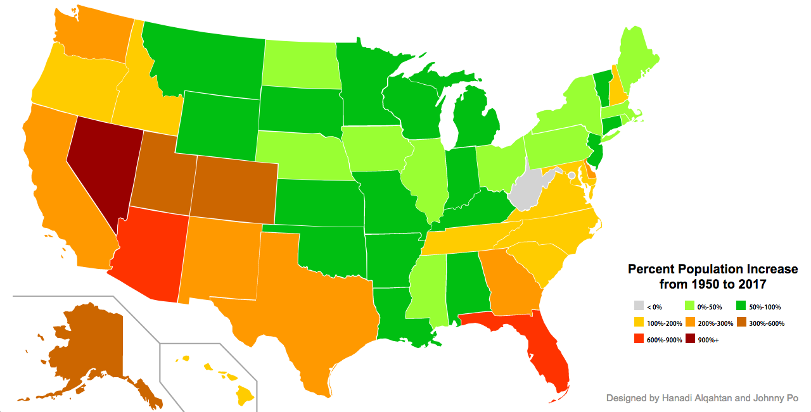

# USA-Interactive-Map

## Introduction 
This is an Interactive Visualization webpage of the map of the United States. This is a project for CS 458 - Information Visualization. The goal of this project is to provide students with an additional resource to learn both important and interesting information about each of the 50 states of the U.S. However, this website is not just limited to people in the field of education. We intend for this webpage to be accessible for anyone and everyone who is curious to learn more about the United States. For now, the site is hosted on the OSU school servers, but may be transferred somewhere else at a later date. 

### Meta
- **State:** Production
- **Point People:** [@jawhnypoh](https://github.com/jawhnypoh), [@Hanoosa](https://github.com/Hanoosa)

## Features
This project includes the following features: 
* Hover over each of the 50 states to find more information including:
    * State Flag
    * State Capital
    * Population in 1950
    * Population in 2017 
    * State's Highest Exports
* Gradient colors to represent percent change in population of each of the 50 states from 1950 to 2017

